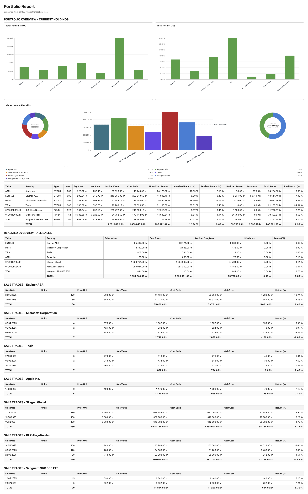

# Portfolio Performance Tracker

Portfolio Performance Tracker is a Java tool that reads investment transactions from CSV files and generates a browser-based portfolio report. It gives you a consolidated view of current holdings, realized and unrealized return, dividends, detailed sale-trade history across both stocks and funds, and visual charts for total return and market value allocation.

## Key Features
- Reads all supported `.csv` files from `transaction_files/`
- Supports comma, semicolon, and tab-separated exports
- Handles UTF-8 and UTF-16 encoded files
- Tracks buys, sells, and dividends across stocks and funds
- Calculates FIFO-based realized gain/loss and return percentages
- Resolves ticker, exchange, and company name using Yahoo Finance data
- Includes visual charts in the report:
	- Total Return bar chart
	- Market Value allocation charts (holdings allocation + asset mix)
- Includes a Realized Overview table (combined realized sales per security)
- Includes Sale Trades tables (every sell transaction per security)
- Report can be exported to PDF from the browser

## Quick Start
1. Export transaction history from your broker/bank as CSV files.
2. Put the files in `transaction_files/`.
3. Compile and run:

```bash
javac src/*.java
java -cp src PortfolioTracker
```

The program generates `portfolio-report.html`.

## CSV Notes
- All `.csv` files in `transaction_files/` are loaded.
- Files with `example` in the filename are ignored by default.
- Required columns in supported exports are `Verdipapir` and `Transaksjonstype`.

## Example Data
- `transaction_files/transactions_example.csv` contains realistic sample transactions with both gains and losses.

## Portfolio Example

