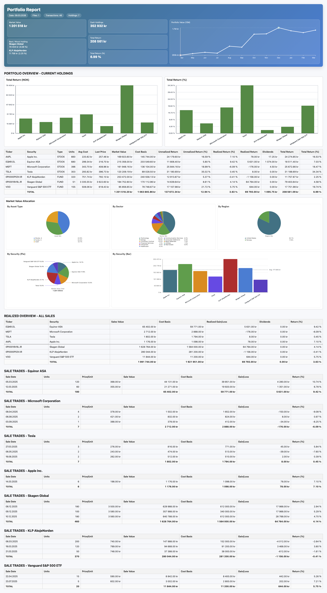

# Portfolio Reporting Platform

Portfolio Reporting Platform is a program that turn raw broker/bank investment transactions into a browser-based portfolio report. It gives you a consolidated view of current holdings, realized and unrealized return, dividends, full sale-trade history, visual charts for total return and market value allocation, across both stocks and funds, in mixed currencies.

The same Java engine runs in two places: a **local CLI** and a **hosted web app**.



## Features

- **Broker-agnostic CSV ingestion** — comma, semicolon, and tab-separated files, with charset auto-detection and tolerant numeric parsing.
- **Transaction tracking** — buys, sells, dividends, corporate actions, and cancelled orders, consolidated into current holdings.
- **Returns** — FIFO cost basis, realized and unrealized P&L, dividends, and a per-security sale-trade breakdown.
- **Mixed currencies** — per-holding figures stay in native currency; totals are aggregated using cached FX rates. The report embeds the rate table and lets you switch the displayed currency on the fly, no regeneration needed.
- **Market-data enrichment** — ticker, latest price, sector and region resolved from Yahoo Finance (in parallel) for richer labeling and allocation charts.
- **Two report types** — a **Standard** portfolio snapshot and an **Annual** report (per-year return, benchmark comparison, volatility / Sharpe / beta, and a Monte Carlo projection).
- **Self-contained output** — one HTML file with inline CSS/JS and SVG charts; responsive down to mobile.

## Requirements

- JDK 21+ (`java -version` should report 21 or newer).

## Quick Start (local CLI)

1. Export your transaction history to CSV.
2. Put the files in `transaction_files/` (filenames containing `example` are skipped, so the bundled sample won't be mixed into your own runs).
3. Compile and run:

   ```bash
   javac -d out src/*.java src/*/*.java
   java -cp out PortfolioReportGenerator
   ```

This writes **`portfolio-report.html`** in the project root. Open it in any browser.

> Market-data enrichment (prices, sector, region) needs network access to Yahoo
> Finance. Offline, the report still generates. Transaction figures such as units,
> cost basis, realized gain and dividends are unaffected, while price-dependent
> values display a placeholder instead of a guessed number.

## Web App

A hosted version adds an authenticated, multi-file workflow on top of the same
engine:

- Email/password login.
- Upload and manage transaction files per user.
- Choose portfolio and report type (Standard or Annual).
- Generate reports server-side and render them in the browser.
- An in-report **Update** button refreshes live prices without re-reading transactions.
- Uploaded files and generated reports are stored per user.

Access is by request on mail.

## Example Data

`transaction_files/transactions_example.csv` is a realistic sample with both
gains and losses — useful for trying the CLI without your own exports.

## Development

Run the test suite (offline, deterministic) after any change to the Java core:

```bash
javac -d out src/*.java src/*/*.java
java -cp out tests.RunAll
```

It covers the calculation golden masters plus CSV parsing, currency conversion,
security identity, date/number/JSON parsing, and HTML formatting.

## Project Layout

```
src/                  Java core: CSV parsing, calculations, report generation
  csv/                CSV loading + in-memory transaction store
  model/              Security and event domain model
  report/             Calculator, HTML writer, chart builder, formatters
  util/               Date / JSON helpers
  tests/              Offline test suite (run via tests.RunAll)
transaction_files/    Local CSV inputs (example file bundled)
portfolio-report.html Generated output (local runs)
```
